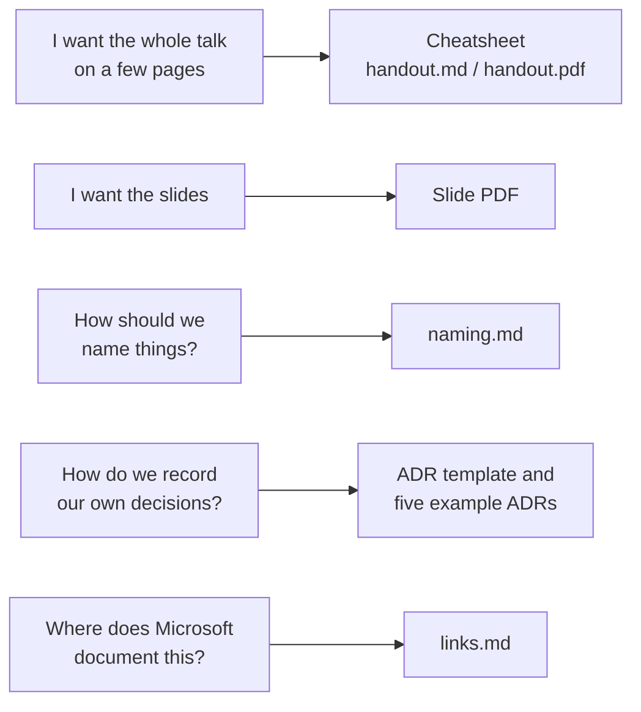

# FabCon Europe 2026, Barcelona

Material for my sessions at the European Microsoft Fabric + SQL Community Conference 2026 in Barcelona (28 September to 1 October 2026).

## Sessions

| Session | Format | Material |
|---|---|---|
| Architecture Before Technology | Community Hub talk, Thursday 1 October, 30 minutes | [architecture-before-technology/](architecture-before-technology/): slides, cheatsheet, ADR template with five example ADRs, naming reference, Microsoft Learn links per answer |

## Where to start

If you came here from the QR code on the slides, pick the question you have right now:

All files are in [architecture-before-technology/](architecture-before-technology/).

## Author

Matthias Falland, Microsoft Data Platform MVP. LinkedIn: [linkedin.com/in/matthias-falland](https://www.linkedin.com/in/matthias-falland/)

Questions, disagreements and your own "month six" stories are welcome on LinkedIn.

## License

Content in this repository is licensed under [CC BY 4.0](LICENSE), except the conference template, logos and photos in the slide PDF, which belong to their owners. Microsoft, Fabric and related names are trademarks of Microsoft; linked Microsoft Learn pages are Microsoft's content.
