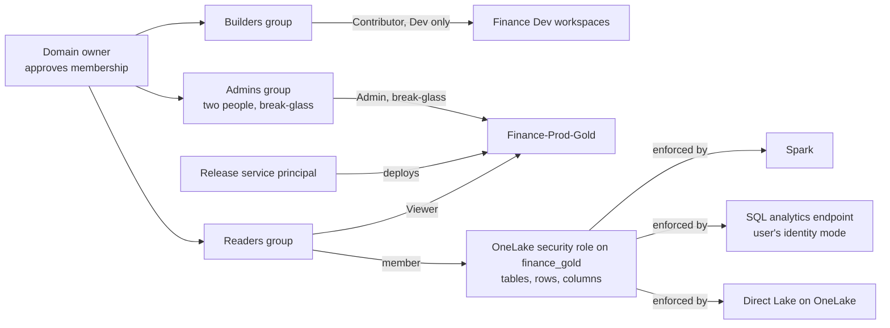
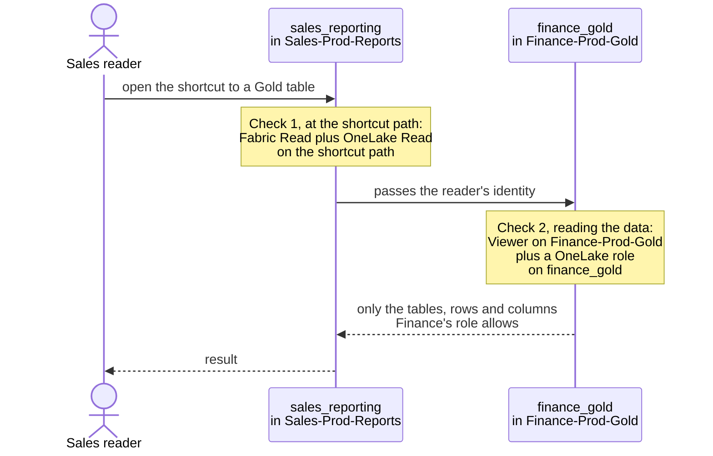

# ADR-0005: Permission model: owner per domain, roles in OneLake

- **Status:** Accepted (example)
- **Status history:** 2026-10-01 Proposed; 2026-10-01 Accepted (example)
- **Date:** 2026-10-01
- **Owner:** Platform architect for the model; each domain owner for the membership of their groups
- **Confidence:** medium. OneLake security is generally available since May 2026 and has documented limits that matter (no dynamic row-level security, table renames break roles).
- **Revisit when:** a reader requirement needs dynamic or multi-table row-level security, or data masking; or a Gold item approaches the limit of roles per item
- **Related:** [ADR-0001](0001-workspace-cut.md) (the workspaces the roles apply to), [ADR-0002](0002-lakehouse-lakehouse-lakehouse.md) (why Gold is a lakehouse), [ADR-0004](0004-release-path-fabric-cicd.md) (role membership is not deployed)

## Context

The month-six sentence is "Who can see this report?". Permissions were set in three places: row-level security in a semantic model, GRANTs on a SQL endpoint, and personal accounts in workspace roles. Nobody can answer the question without opening all three, and people who left the team still have access. The example organisation needs one place where read access to Finance data is decided, and one person per domain who says yes.

## Decision

1. **Groups, not people.** Workspace roles are assigned to Microsoft Entra security groups only. Per domain and stage there is one set of groups shared by that domain's workspaces: admins (at least two people), builders, and, for Gold and for consumer workspaces, readers.
2. **Roles per stage.** In Dev, builders are Contributors. No builder or Contributor role for humans in Test and Prod. The admins group (two named people, ideally just-in-time via PIM) is break-glass only. Every human change shows up in the audit log, which Fabric writes to the Microsoft Purview audit log ([Track user activities in Microsoft Fabric](https://learn.microsoft.com/fabric/admin/track-user-activities?wt.mc_id=AZ-MVP-5003447)). The release service principal deploys (ADR-0004). Bronze and Silver have no readers.
3. **Readers of Gold get Viewer plus a OneLake security role** on `finance_gold`, with the tables, rows and columns they may see. Every group added to a restricted role is removed from the DefaultReader role (or DefaultReader is edited). The SQL analytics endpoint of Gold runs in user's identity mode, and so does the SQL analytics endpoint of every consumer lakehouse that holds shortcuts to Gold.
4. **Consumers read with their own identity, so they need access at both ends.** Sales readers are Viewers of Sales-Prod-Reports with a OneLake role (Read) on the shortcut path in the Sales lakehouse. On the Finance side they are Viewers of Finance-Prod-Gold (a workspace role: Microsoft notes that "A schema-enabled lakehouse can't currently be shared directly" ([Lakehouse schemas](https://learn.microsoft.com/fabric/data-engineering/lakehouse-schemas?wt.mc_id=AZ-MVP-5003447)), so item sharing is not the way in) and members of a OneLake role on `finance_gold`. The shortcut passes their identity to Gold, so Finance's row and column rules apply to them.
5. **The domain owner approves group membership.** This is our process, run in the identity tooling; Fabric has no approval feature for it. Each domain's owner is also its Fabric domain admin.
6. **Report models on Gold data use Direct Lake on OneLake,** not Direct Lake on SQL (see consequences).

Who gets what for the Finance data. Groups carry the workspace roles; readers get Viewer plus a OneLake security role on `finance_gold`, and the role is enforced by every engine that reads the data.

## Options considered

1. **Permissions per engine** (semantic model row-level security, SQL GRANTs, report sharing). *Rejected because* it is the three-places problem from the context.
2. **Workspace roles only.** *Rejected because* a workspace role is all or nothing for the workspace: no rows, no columns, no subset of tables.
3. **Warehouse T-SQL security on Gold.** *Rejected because* it is enforced only in the warehouse's SQL context, and "users accessing the data through a shortcut might see the full warehouse data" ([OneLake security for SQL analytics endpoints](https://learn.microsoft.com/fabric/onelake/security/sql-analytics-endpoint-onelake-security?wt.mc_id=AZ-MVP-5003447)). See ADR-0002.
4. **Row-level security in each semantic model.** *Rejected because* it protects reports only; anyone who reads the lakehouse with SQL or Spark never passes through the model.
5. **Groups in workspace roles, OneLake security roles on Gold (chosen).**

## Why

- **OneLake security is deny by default and applies at the data.** Roles grant Read (or ReadWrite) to tables and folders, with row and column rules, and are enforced by the lakehouse, Spark, the SQL analytics endpoint in user's identity mode and Direct Lake on OneLake ([Data access control model](https://learn.microsoft.com/fabric/onelake/security/data-access-control-model?wt.mc_id=AZ-MVP-5003447), [Read data secured with OneLake security](https://learn.microsoft.com/fabric/onelake/security/read-secured-data?wt.mc_id=AZ-MVP-5003447)).
- **Viewers see no data without a role.** In the workspace roles table, Viewer can't read data in OneLake, with the footnote "You can give Viewers access to data by using OneLake security roles" ([Data security in OneLake](https://learn.microsoft.com/fabric/onelake/security/get-started-security?wt.mc_id=AZ-MVP-5003447)). Viewer plus a role is exactly the reader we want.
- **Microsoft's primary pattern.** Secure the data in the workspace that owns it, give readers Viewer and a role, run SQL endpoints in user's identity mode, and let consumers use shortcuts ([Best practices for OneLake security](https://learn.microsoft.com/fabric/onelake/security/best-practices-secure-data-in-onelake?wt.mc_id=AZ-MVP-5003447)).
- **Shortcuts pass the reader's identity.** For OneLake-to-OneLake shortcuts in the same tenant, passthrough is the default: "the shortcut accesses data in the target location by passing the user's identity to the target system" ([OneLake shortcut security](https://learn.microsoft.com/fabric/onelake/onelake-shortcut-security?wt.mc_id=AZ-MVP-5003447)). The Gold role therefore applies to Sales readers too. Two different checks apply: listing the shortcut in the Sales lakehouse needs "Fabric Read *plus* OneLake security Read" on the shortcut path; reading the data behind it is checked at the target against Finance's roles. Microsoft's Direct Lake guidance says the same from the model side: "If a source item has shortcuts to another Fabric item, the user also needs *read* access to each shortcut's target Fabric item" ([Integrate Direct Lake security](https://learn.microsoft.com/fabric/fundamentals/direct-lake-security-integration?wt.mc_id=AZ-MVP-5003447)).
- **Groups.** Microsoft: "A best practice is to use groups to assign workspace roles" ([Workspaces at the workspace level](https://learn.microsoft.com/power-bi/guidance/powerbi-implementation-planning-workspaces-workspace-level-planning?wt.mc_id=AZ-MVP-5003447)), and security groups "offer the highest coverage" across Fabric settings ([Tenant-level security planning](https://learn.microsoft.com/power-bi/guidance/powerbi-implementation-planning-security-tenant-level-planning?wt.mc_id=AZ-MVP-5003447)).
- **Domain admins from the business.** Microsoft suggests domain admins are ideally the business owners of the domain; the domain role manages domain settings and doesn't grant data access ([Fabric domains](https://learn.microsoft.com/fabric/governance/domains?wt.mc_id=AZ-MVP-5003447)).

A Sales reader passes two checks. The first is on the shortcut in the Sales lakehouse; the second happens at Gold with the reader's own identity, so Finance's rules decide which data comes back.

## Consequences and trade-offs

- **Admin, Member and Contributor bypass OneLake roles.** Giving readers Contributor "so they can use the SQL endpoint" silently removes every row and column rule. The one exception: row-level security on the SQL analytics endpoint in user's identity mode applies to all users, including those roles ([OneLake security for SQL analytics endpoints](https://learn.microsoft.com/fabric/onelake/security/sql-analytics-endpoint-onelake-security?wt.mc_id=AZ-MVP-5003447)).
- **DefaultReader keeps everyone in.** "When you add a user to a OneLake security role, remove them from the DefaultReader role. Otherwise, they keep full access to the data" ([Create and manage OneLake security roles](https://learn.microsoft.com/fabric/onelake/security/create-manage-roles?wt.mc_id=AZ-MVP-5003447)).
- **The endpoint mode has to be switched, once, carefully.** "Newly created SQL analytics endpoints start in delegated identity access mode by default. Before you can use OneLake security with an endpoint, an Admin or Member must switch it to User's identity access mode." Switching makes SQL analytics endpoints in the workspace temporarily unavailable, cancels running and queued queries, and removes existing SQL roles ([OneLake security for SQL analytics endpoints](https://learn.microsoft.com/fabric/onelake/security/sql-analytics-endpoint-onelake-security?wt.mc_id=AZ-MVP-5003447)). Do it before Gold goes live, for Gold and for every consumer lakehouse that holds shortcuts to Gold.
- **Consumer endpoints need user's identity mode too.** "Shortcuts pointing to source tables with RLS or CLS in OneLake security on the producer are not accessible through the SQL analytics endpoint in delegated mode, even if the end user has SQL permissions on the shortcut object"; Microsoft's remedy is "user identity mode at the consumer endpoint" ([OneLake security for SQL analytics endpoints](https://learn.microsoft.com/fabric/onelake/security/sql-analytics-endpoint-onelake-security?wt.mc_id=AZ-MVP-5003447)).
- **Direct Lake on SQL doesn't fit this model.** Through a shortcut, Direct Lake on SQL and T-SQL in delegated mode "use the item owner's identity" to reach the target, not the reader's ([OneLake shortcut security](https://learn.microsoft.com/fabric/onelake/onelake-shortcut-security?wt.mc_id=AZ-MVP-5003447)). Once the endpoint runs with the reader's identity, OneLake roles become SQL rules and "Direct Lake on SQL falls back to DirectQuery 100% of the time" ([Integrate Direct Lake security](https://learn.microsoft.com/fabric/fundamentals/direct-lake-security-integration?wt.mc_id=AZ-MVP-5003447)). Direct Lake on OneLake has no DirectQuery fallback and applies OneLake security directly; Microsoft calls it the recommended Direct Lake option for new semantic models ([How Direct Lake works](https://learn.microsoft.com/fabric/fundamentals/direct-lake-how-it-works?wt.mc_id=AZ-MVP-5003447)). Build report models as Direct Lake on OneLake.
- **Row-level security is static.** "RLS roles don't support dynamic and multitable queries"; row and column rules for one table belong in the same role ([Table, column, and row-level security](https://learn.microsoft.com/fabric/onelake/security/table-column-row-security?wt.mc_id=AZ-MVP-5003447)). A per-user filter needs one role per filter value or a different design.
- **No data masking.** Dynamic data masking isn't part of OneLake security ([OneLake security for SQL analytics endpoints](https://learn.microsoft.com/fabric/onelake/security/sql-analytics-endpoint-onelake-security?wt.mc_id=AZ-MVP-5003447)).
- **Column security changes `SELECT *`.** Spark returns the allowed columns; the SQL analytics endpoint and semantic models return an error ([Table, column, and row-level security](https://learn.microsoft.com/fabric/onelake/security/table-column-row-security?wt.mc_id=AZ-MVP-5003447)). Reports must name their columns.
- **Table renames break roles.** "Renaming a table breaks the association, and policies do not migrate automatically. This can result in unintended data exposure until policies are reapplied" ([OneLake security for SQL analytics endpoints](https://learn.microsoft.com/fabric/onelake/security/sql-analytics-endpoint-onelake-security?wt.mc_id=AZ-MVP-5003447)). Gold table names are stable by rule ([naming.md](../naming.md)).
- **Identity details at the SQL endpoint.** Mail-enabled security groups and distribution lists "are not currently supported"; across a shortcut, the SQL endpoint maps the exact group on both sides and doesn't resolve nested membership across that boundary ([OneLake security for SQL analytics endpoints](https://learn.microsoft.com/fabric/onelake/security/sql-analytics-endpoint-onelake-security?wt.mc_id=AZ-MVP-5003447)). Use plain security groups and the same group at both ends.
- **Changes aren't instant.** Role changes take about five minutes; group membership changes can take about an hour, and some engines add up to another hour ([Data access control model](https://learn.microsoft.com/fabric/onelake/security/data-access-control-model?wt.mc_id=AZ-MVP-5003447)). Tell the owners before they test a new member.
- **Limits.** 250 roles per item (more on request) and 500 members per role ([Data access control model](https://learn.microsoft.com/fabric/onelake/security/data-access-control-model?wt.mc_id=AZ-MVP-5003447)). Groups keep member counts small.
- **Memberships are not deployed, and whoever sets them needs the right role.** Entra members of OneLake roles are ignored by lakehouse CI/CD ([Lakehouse definition](https://learn.microsoft.com/rest/api/fabric/articles/item-management/definitions/lakehouse-definition?wt.mc_id=AZ-MVP-5003447)). Role definitions and group assignments per stage are set by a script that runs with the release (ADR-0004). Managing OneLake roles needs Fabric Write or Reshare permission, "generally included for Admin or Member workspace users" ([Create and manage OneLake security roles](https://learn.microsoft.com/fabric/onelake/security/create-manage-roles?wt.mc_id=AZ-MVP-5003447)), and switching the endpoint mode needs Admin or Member. The identity that runs this script is therefore Member on the Gold workspace (or a separate security service principal), not only Contributor. The identity that creates the shortcuts in a consumer workspace needs Read on the Gold target, too ([OneLake shortcut security](https://learn.microsoft.com/fabric/onelake/onelake-shortcut-security?wt.mc_id=AZ-MVP-5003447)).
- **Row-level security costs capacity:** 1 CU second per million rows in the table ([OneLake consumption](https://learn.microsoft.com/fabric/onelake/onelake-consumption?wt.mc_id=AZ-MVP-5003447)).

## Sources

Checked on Microsoft Learn on 2026-09-30.

- [How OneLake security controls data access](https://learn.microsoft.com/fabric/onelake/security/data-access-control-model?wt.mc_id=AZ-MVP-5003447)
- [Best practices for OneLake security](https://learn.microsoft.com/fabric/onelake/security/best-practices-secure-data-in-onelake?wt.mc_id=AZ-MVP-5003447)
- [Data security in OneLake](https://learn.microsoft.com/fabric/onelake/security/get-started-security?wt.mc_id=AZ-MVP-5003447)
- [Create and manage OneLake security roles](https://learn.microsoft.com/fabric/onelake/security/create-manage-roles?wt.mc_id=AZ-MVP-5003447)
- [Table, column, and row-level security in OneLake](https://learn.microsoft.com/fabric/onelake/security/table-column-row-security?wt.mc_id=AZ-MVP-5003447)
- [OneLake security for SQL analytics endpoints](https://learn.microsoft.com/fabric/onelake/security/sql-analytics-endpoint-onelake-security?wt.mc_id=AZ-MVP-5003447)
- [Read data secured with OneLake security](https://learn.microsoft.com/fabric/onelake/security/read-secured-data?wt.mc_id=AZ-MVP-5003447)
- [OneLake shortcut security](https://learn.microsoft.com/fabric/onelake/onelake-shortcut-security?wt.mc_id=AZ-MVP-5003447)
- [Integrate Direct Lake security](https://learn.microsoft.com/fabric/fundamentals/direct-lake-security-integration?wt.mc_id=AZ-MVP-5003447)
- [How Direct Lake works](https://learn.microsoft.com/fabric/fundamentals/direct-lake-how-it-works?wt.mc_id=AZ-MVP-5003447)
- [What are lakehouse schemas?](https://learn.microsoft.com/fabric/data-engineering/lakehouse-schemas?wt.mc_id=AZ-MVP-5003447)
- [Track user activities in Microsoft Fabric](https://learn.microsoft.com/fabric/admin/track-user-activities?wt.mc_id=AZ-MVP-5003447)
- [Power BI implementation planning: Workspaces at the workspace level](https://learn.microsoft.com/power-bi/guidance/powerbi-implementation-planning-workspaces-workspace-level-planning?wt.mc_id=AZ-MVP-5003447)
- [Power BI implementation planning: Tenant-level security planning](https://learn.microsoft.com/power-bi/guidance/powerbi-implementation-planning-security-tenant-level-planning?wt.mc_id=AZ-MVP-5003447)
- [Fabric domains](https://learn.microsoft.com/fabric/governance/domains?wt.mc_id=AZ-MVP-5003447)
- [Lakehouse definition](https://learn.microsoft.com/rest/api/fabric/articles/item-management/definitions/lakehouse-definition?wt.mc_id=AZ-MVP-5003447)
- [OneLake compute and storage consumption](https://learn.microsoft.com/fabric/onelake/onelake-consumption?wt.mc_id=AZ-MVP-5003447)
- [What's new in Microsoft Fabric (archive)](https://learn.microsoft.com/fabric/fundamentals/whats-new-archive?wt.mc_id=AZ-MVP-5003447) (OneLake security generally available, May 2026)
