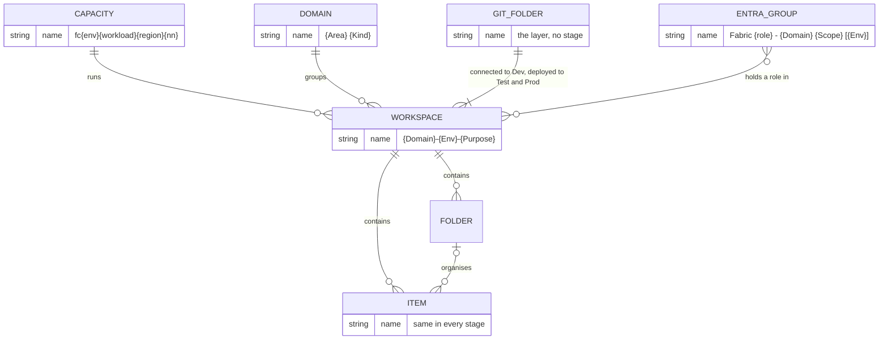
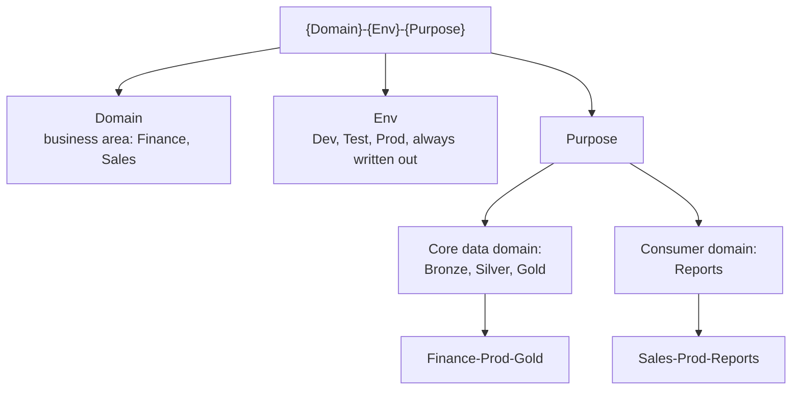
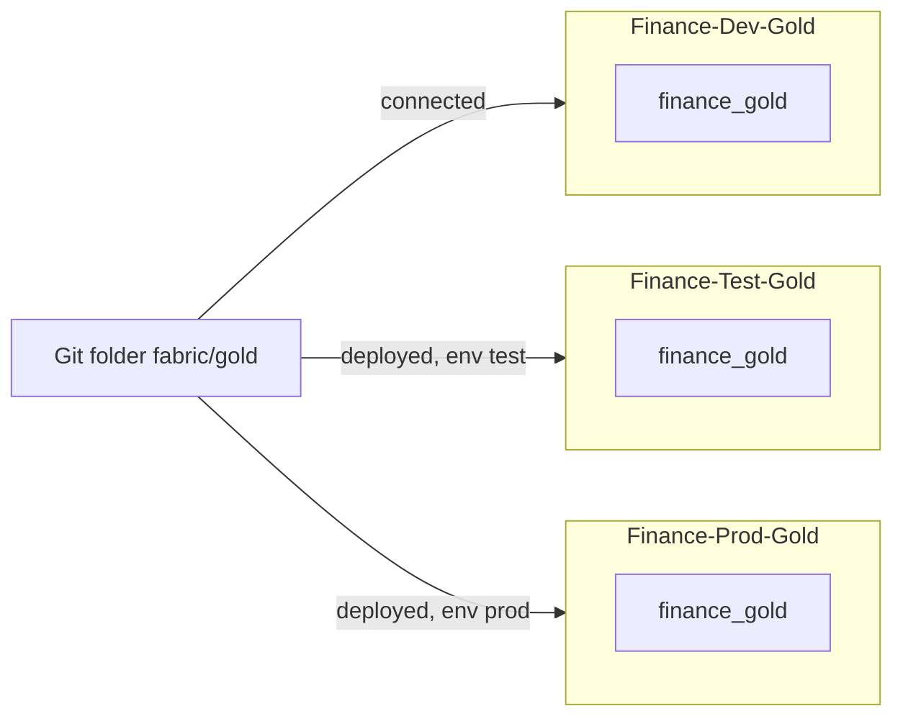

# Naming convention: reference

A name is the cheapest documentation you will ever write, and some Fabric names can never be changed. This page covers everything that gets a name on a Fabric data platform, from the capacity to the Git branch, for the example organisation in the [ADRs](adr/) (core data domain Finance, consumer domain Sales).

In a hurry: the [quick reference](#quick-reference) table is the whole convention on one screen; the sections below give the rule and the source for each line.

Each rule is marked **(Microsoft)** with a link when it is Microsoft's rule or guidance, or **(my recommendation)** when it is my choice. Sources were checked on Microsoft Learn on 2026-09-30.

## Four principles

1. **Put only what stays constant into a name.** "Most Azure resource names can't be changed after creation. Include only information that remains constant in the name. Use tags to capture other details." (Microsoft, [CAF naming](https://learn.microsoft.com/azure/cloud-adoption-framework/ready/azure-best-practices/resource-naming?wt.mc_id=AZ-MVP-5003447)). Team names, SKUs and project code names change; domains, stages and layers don't.
2. **Most important part first.** Put "the most important part at the beginning of the name", because long workspace names get truncated (Microsoft, [Workspace naming](https://learn.microsoft.com/power-bi/guidance/powerbi-implementation-planning-workspaces-tenant-level-planning?wt.mc_id=AZ-MVP-5003447)).
3. **The stage lives in containers, never in items.** Workspaces, capacities, groups and value sets carry Dev, Test or Prod. Lakehouses, notebooks, pipelines, models and reports have the same name in every stage (my recommendation, for the reason in the Items section).
4. **One pattern, written down, checked.** "Usually, naming conventions are a requirement and not a suggestion", and Microsoft suggests an audit "to find workspaces that don't conform" (Microsoft, [Workspace naming](https://learn.microsoft.com/power-bi/guidance/powerbi-implementation-planning-workspaces-tenant-level-planning?wt.mc_id=AZ-MVP-5003447)). Record the pattern in an ADR before the first workspace exists.

## Quick reference

| Object | Pattern | Example |
|---|---|---|
| Capacity | `fc{env}{workload}{region}{nn}`, lowercase letters and digits only | `fcprodjobseu01`, `fcprodreportseu01`, `fcnonprodeu01` |
| Domain | `{Area} {Kind}` | Finance Data, Customer Data, Finance Reports, Sales Reports |
| Core data workspace | `{Domain}-{Env}-{Layer}` | Finance-Prod-Bronze, Finance-Prod-Silver, Finance-Prod-Gold |
| Consumer workspace | `{Domain}-{Env}-Reports` | Sales-Dev-Reports, Sales-Prod-Reports |
| Folder (consumer workspace) | Team name | Sales Operations, Key Accounts |
| Lakehouse | `{domain}_{layer}`, lowercase | `finance_bronze`, `finance_gold`, `sales_reporting` |
| Schema | Source system (Bronze), subject (Silver, Gold), lowercase | `erp`, `crm`, `sales`, `finance` |
| Table | lowercase with underscores; Gold with `dim_`/`fact_` | `invoice`, `dim_customer`, `fact_invoice` |
| Notebook, pipeline | `{verb}_{layer or scope}_{subject}` | `load_bronze_erp`, `build_gold_sales`, `run_finance_daily` |
| Semantic model, report | Business name, no stage, no version | Sales Performance |
| Entra group | `Fabric {role} - {Domain} {Scope} [{Env}]` | Fabric workspace admins - Finance Data [Prod] |
| OneLake security role | `Read{Scope}`, letters and digits | `ReadAllGold`, `ReadInvoicesEU` |
| Git repository and folders | one repository per domain, one folder per layer workspace | `fabric/bronze`, `fabric/gold` |
| Branches | `main` for integration, `feature/{ticket}-{topic}` | `feature/417-invoice-vat` |
| Release environments, value sets | `dev`, `test`, `prod` | `prod` |

How the named objects relate. Each workspace runs on one capacity, sits in one domain and is connected to or deployed from one Git folder; groups hold roles across workspaces; items keep the same name in every stage.

## Capacities

- **Letters and digits, lowercase, 3 to 63 characters, starting with a letter.** The Azure resource definition for `Microsoft.Fabric/capacities` constrains the name to pattern `^[a-z][a-z0-9]*$`, minimum 3, maximum 63 (Microsoft, [ARM template reference](https://learn.microsoft.com/azure/templates/microsoft.fabric/capacities?wt.mc_id=AZ-MVP-5003447)). No hyphens, no uppercase. Some Microsoft pages show capacity names with hyphens as illustrations; the resource definition is what the deployment checks.
- **The name is permanent.** "You can't change the Fabric capacity name once it's created. If you need to change the name, you must delete the existing capacity and create a new one" (Microsoft, [Capacity planning part 3](https://learn.microsoft.com/fabric/enterprise/capacity-planning-enterprise-managed-self-service-solutions?wt.mc_id=AZ-MVP-5003447)); the admin portal says the same: "You can't change a Fabric capacity's name" (Microsoft, [Capacity settings](https://learn.microsoft.com/fabric/admin/capacity-settings?wt.mc_id=AZ-MVP-5003447)).
- **Name purpose and criticality.** Microsoft suggests including "prod" versus "dev", or "tier 1" versus "tier 2", with the example `fabricprodtier1eu`, and its tier-1 checklist asks that the "Capacity name identifies tier 1" (Microsoft, [Capacity planning part 3](https://learn.microsoft.com/fabric/enterprise/capacity-planning-enterprise-managed-self-service-solutions?wt.mc_id=AZ-MVP-5003447)).
- **Start with `fc`.** The Cloud Adoption Framework abbreviation for Fabric capacity is `fc` (Microsoft, [Abbreviations](https://learn.microsoft.com/azure/cloud-adoption-framework/ready/azure-best-practices/resource-abbreviations?wt.mc_id=AZ-MVP-5003447)). Then environment, workload, region, instance number: the CAF components without the delimiters the resource doesn't allow (my recommendation, following [CAF naming](https://learn.microsoft.com/azure/cloud-adoption-framework/ready/azure-best-practices/resource-naming?wt.mc_id=AZ-MVP-5003447)).
- **No team, domain or SKU in the name.** Teams get renamed, workspaces move between capacities, SKUs get resized; the capacity name stays. Put owner and cost centre into Azure tags (my recommendation, following CAF principle 1 above).

## Domains

- **Name domains after the business area and the kind of domain:** Finance Data (core data domain), Finance Reports and Sales Reports (consumer domains). The `{Domain}` token in workspace names is the area, so the workspaces of a domain are easy to find and select (my recommendation).
- **Consistent workspace names make assignment easy.** Microsoft lists assignment by workspace name, owner or capacity; its example: "a workspace named Finance-Accounting-Report would be assigned to that Accounting subdomain" (Microsoft, [Domain best practices](https://learn.microsoft.com/fabric/governance/domains-best-practices?wt.mc_id=AZ-MVP-5003447)). The admin portal lets you search by workspace name and select several workspaces at once (Microsoft, [Fabric domains](https://learn.microsoft.com/fabric/governance/domains?wt.mc_id=AZ-MVP-5003447)).
- **Separate domains where owners differ, subdomains where they don't.** Subdomains don't have their own domain admins, and domain admins can't change the domain name (Microsoft, [Fabric domains](https://learn.microsoft.com/fabric/governance/domains?wt.mc_id=AZ-MVP-5003447)). If Finance Data and Finance Reports have different owners, they are two domains.
- **Dev and Test belong to the domain too.** Otherwise their usage appears under "No domain" in the Chargeback app (Microsoft, [Chargeback app](https://learn.microsoft.com/fabric/enterprise/chargeback-app?wt.mc_id=AZ-MVP-5003447)).

## Workspaces

**Pattern:** `{Domain}-{Env}-{Purpose}`, where Purpose is the layer (Bronze, Silver, Gold) in core data domains and `Reports` in consumer domains ([ADR-0001](adr/0001-workspace-cut.md)).

The name has three parts, and only the last one depends on the kind of domain.

| Workspace | Kind |
|---|---|
| Finance-Dev-Bronze, Finance-Dev-Silver, Finance-Dev-Gold | Core data domain, development |
| Finance-Test-Bronze, Finance-Test-Silver, Finance-Test-Gold | Core data domain, test |
| Finance-Prod-Bronze, Finance-Prod-Silver, Finance-Prod-Gold | Core data domain, production; readers only on Gold |
| Sales-Dev-Reports, Sales-Test-Reports, Sales-Prod-Reports | Consumer domain, one per stage, folders per team |
| Finance-Prod-Reports | Finance's own reports, a consumer of Finance Gold like everyone else |

- **What a workspace name may carry.** Microsoft lists purpose, item types, stage and ownership as candidates (Microsoft, [Workspace naming](https://learn.microsoft.com/power-bi/guidance/powerbi-implementation-planning-workspaces-tenant-level-planning?wt.mc_id=AZ-MVP-5003447)).
- **Words to leave out.** Microsoft suggests omitting "workspace", "Fabric or Power BI" and the organisation name (Microsoft, same page).
- **Renaming is mostly safe.** The workspace ID doesn't change, "However, XMLA connections are affected because they connect by using the workspace name" (Microsoft, same page). Tools that connect to semantic models by workspace name break after a rename.
- **Description, contacts, owner.** Microsoft's governed-workspace checklist includes a description and contacts (Microsoft, same page). Put the owner and a link to the ADR into the description (my recommendation).

### Prod with or without a suffix?

Microsoft: "We recommend appending [Dev] or [Test] suffixes but leaving production as a user-friendly name without a suffix" ([Workspace naming](https://learn.microsoft.com/power-bi/guidance/powerbi-implementation-planning-workspaces-tenant-level-planning?wt.mc_id=AZ-MVP-5003447)). That optimises for people who browse production workspaces and shouldn't be distracted by a technical token.

**My recommendation: write `Prod` explicitly.** Reasons:

1. **Every name has the same parts.** `Finance-Prod-Gold` sorts next to `Finance-Dev-Gold` and `Finance-Test-Gold`; a script or an audit reads the stage from position two without a special case for "missing means production".
2. **Missing is ambiguous.** Is `Finance-Gold` production, or did someone forget the suffix? An audit can only flag non-conforming names if a conforming name is complete.
3. **The platform's workspaces are for builders.** In this cut, readers of Finance data work in Gold through their own tools, and readers of reports mostly arrive through a link or an app; the people who see the whole workspace list are builders and admins, who need the stage.
4. **The release maps environments to workspaces.** fabric-cicd deploys `prod` to `Finance-Prod-Gold`; the mapping is readable at a glance.

Either choice works if it is the only one. Don't mix them, and write the choice into the ADR.

## Folders in consumer workspaces

- **One folder per team** that builds reports in the workspace, for example Sales Operations and Key Accounts (my recommendation; the talk uses "folders per team").
- **Folders organise, they don't secure.** "Currently, folders inherit the permissions of the workspace where they're located" (Microsoft, [Folders in workspaces](https://learn.microsoft.com/fabric/fundamentals/workspaces-folders?wt.mc_id=AZ-MVP-5003447)). If a team's content needs different readers, it needs a different workspace, not a folder.
- **Name rules.** No leading or trailing spaces, none of `~ " # . & * : < > ? / { | }`, at most 255 characters, unique within the parent; up to 10 levels of nesting (Microsoft, same page). Stay at one level (my recommendation).

## Items

- **The same name in every stage.** Microsoft on referencing a lakehouse in a release: "Using the lakehouse ID is problematic because it's always different across workspaces ... Instead, pass the lakehouse name. The lakehouse name stays the same across all environments, eliminating the need for parameterization" (Microsoft, [CI/CD best practices](https://learn.microsoft.com/fabric/fundamentals/understand-best-practices-fabric-cicd?wt.mc_id=AZ-MVP-5003447)). A stage suffix in an item name (`finance_gold_dev`) turns every such reference into a parameter. Same names cover connections that accept a lakehouse name, not everything: references that cross workspace boundaries (a Silver notebook reading Bronze, a shortcut to Finance Gold) still need an item reference variable in the variable library or a `find_replace` rule in the parameter file, because "Fabric only supports auto-binding behavior between items that exist in the same workspace" (Microsoft, [CI/CD best practices](https://learn.microsoft.com/fabric/fundamentals/understand-best-practices-fabric-cicd?wt.mc_id=AZ-MVP-5003447)).
- **Lakehouse names:** begin with a letter; letters, digits and underscores only; at most 123 characters (Microsoft, [Create a lakehouse](https://learn.microsoft.com/fabric/data-engineering/create-lakehouse?wt.mc_id=AZ-MVP-5003447)). Use `{domain}_{layer}` in lowercase, `finance_bronze`, `finance_silver`, `finance_gold`, even though the workspace already says the layer: lakehouse names appear without the workspace in shortcut dialogs, notebooks and SQL (my recommendation). The lakehouse in a consumer workspace that holds the shortcuts: `sales_reporting`.
- **No type prefixes.** Fabric shows the item type, and Git integration names each item folder `{display name}.{public facing type}` (Microsoft, [Git source code format](https://learn.microsoft.com/fabric/cicd/git-integration/source-code-format?wt.mc_id=AZ-MVP-5003447)), so `nb_` or `lh_` repeats what is already there (my recommendation).
- **Notebooks and pipelines:** verb, layer or scope, subject: `load_bronze_erp`, `build_silver_invoice`, `build_gold_sales`, `setup_tables` for the schema notebook in the post-deploy step, `run_finance_daily` for the top-level pipeline (my recommendation).
- **Semantic models and reports:** business names that readers understand, with spaces, no stage, no "v2", "final" or "copy" (my recommendation).
- **Renames are changes.** The display name becomes the item's folder name in Git, and other items refer to items by path and name (Microsoft, [Git source code format](https://learn.microsoft.com/fabric/cicd/git-integration/source-code-format?wt.mc_id=AZ-MVP-5003447)). Rename in Dev through a pull request and check the references, never directly in Test or Prod (my recommendation).

## Schemas, tables and shortcuts

- **Schemas are on by default** for lakehouses created in the portal; schema names use letters, digits and underscores; every schema-enabled lakehouse has a `dbo` schema that can't be removed (Microsoft, [Lakehouse schemas](https://learn.microsoft.com/fabric/data-engineering/lakehouse-schemas?wt.mc_id=AZ-MVP-5003447)).
- **Lowercase schema names.** For materialized lake views, "All-uppercase schema names (for example, `MYSCHEMA`) aren't supported. Use mixed case or lowercase" (Microsoft, [Materialized lake views, Spark SQL reference](https://learn.microsoft.com/fabric/data-engineering/materialized-lake-views/create-materialized-lake-view?wt.mc_id=AZ-MVP-5003447)). Lowercase avoids the question.
- **Schemas by layer purpose:** Bronze by source system (`erp`, `crm`), Silver and Gold by subject (`sales`, `finance`). Leave `dbo` empty (my recommendation).
- **Table names:** avoid `"` `'` `#` `%` `+` `:` `?` and the backtick, which are "either reserved or not compatible with at least one of Fabric technologies" (Microsoft, [Delta Lake interoperability](https://learn.microsoft.com/fabric/fundamentals/delta-lake-interoperability?wt.mc_id=AZ-MVP-5003447)). Use lowercase with underscores; Silver tables named after the entity (`invoice`), Gold after the model role (`dim_customer`, `fact_invoice`) (my recommendation).
- **Gold table names are stable.** OneLake security roles are tied to the table name: "Renaming a table breaks the association, and policies do not migrate automatically. This can result in unintended data exposure until policies are reapplied" (Microsoft, [OneLake security for SQL analytics endpoints](https://learn.microsoft.com/fabric/onelake/security/sql-analytics-endpoint-onelake-security?wt.mc_id=AZ-MVP-5003447)).
- **Shortcut names:** no `%` or `+`, no non-Latin characters; if the target is moved, renamed or deleted, the shortcut can break (Microsoft, [OneLake shortcuts](https://learn.microsoft.com/fabric/onelake/onelake-shortcuts?wt.mc_id=AZ-MVP-5003447)). Name a shortcut exactly like its target table, so queries written against Gold work unchanged in the consumer (my recommendation).

## Groups, roles and identities

- **Microsoft's group pattern:** `<Prefix> <Purpose> - <Topic/Scope/Department> <[Environment]>`, for example "Power BI workspace viewers - Finance [Dev]" (Microsoft, [Tenant-level security planning](https://learn.microsoft.com/power-bi/guidance/powerbi-implementation-planning-security-tenant-level-planning?wt.mc_id=AZ-MVP-5003447)). I use the prefix "Fabric" (my recommendation).
- **One set of groups per domain and stage.** Microsoft suggests "one group per role per workspace", and adds that "often it's possible to manage a collection of workspaces with one set of groups" (Microsoft, [Workspace-level planning](https://learn.microsoft.com/power-bi/guidance/powerbi-implementation-planning-workspaces-workspace-level-planning?wt.mc_id=AZ-MVP-5003447)). Here, one set covers the three layer workspaces of a domain and stage:
  - Fabric workspace admins - Finance Data [Prod] (two named people, ideally just-in-time via PIM, break-glass only; no builder or Contributor group for humans in Test and Prod)
  - Fabric workspace contributors - Finance Data [Dev]
  - Fabric data readers - Finance Gold [Prod] (Viewer on Finance-Prod-Gold and member of OneLake roles)
  - Fabric workspace viewers - Sales Reports [Prod]
- **Security groups only.** Microsoft: security groups "offer the highest coverage", and groups with dynamic membership "aren't supported for Power BI" (Microsoft, [Tenant-level security planning](https://learn.microsoft.com/power-bi/guidance/powerbi-implementation-planning-security-tenant-level-planning?wt.mc_id=AZ-MVP-5003447)). At the SQL analytics endpoint, OneLake security doesn't support mail-enabled security groups or distribution lists (Microsoft, [OneLake security for SQL analytics endpoints](https://learn.microsoft.com/fabric/onelake/security/sql-analytics-endpoint-onelake-security?wt.mc_id=AZ-MVP-5003447)). Use plain security groups everywhere.
- **OneLake security role names:** letters and digits only, starting with a letter, at most 128 characters (Microsoft, [Create and manage OneLake security roles](https://learn.microsoft.com/fabric/onelake/security/create-manage-roles?wt.mc_id=AZ-MVP-5003447)). But the SQL analytics endpoint adds the prefix `OLS_` and "OneLake security role names cannot exceed 124 characters; otherwise, role creation or synchronization fails on the SQL analytics endpoint" (Microsoft, [OneLake security for SQL analytics endpoints](https://learn.microsoft.com/fabric/onelake/security/sql-analytics-endpoint-onelake-security?wt.mc_id=AZ-MVP-5003447)). Stay under 124. Name roles after what they grant: `ReadAllGold`, `ReadInvoicesEU` (my recommendation).
- **Service principals:** one release service principal per domain, named after its job, for example `sp-fabric-release-finance`; Contributor on the target workspaces, Member where it also manages OneLake security roles or switches the SQL endpoint mode, and Read on Gold where it creates shortcuts in consumer workspaces. If you split security from deployment, a second one: `sp-fabric-security-finance` (my recommendation; role requirements in [ADR-0004](adr/0004-release-path-fabric-cicd.md) and [ADR-0005](adr/0005-permissions-onelake-security.md)).

Principle 3 in one picture: the stage lives in the workspace name, the Git folder and the release environment, while the lakehouse is `finance_gold` in all three stages.

## Deployment pipelines, Git and fabric-cicd

- **Deployment pipeline stages, if you use them:** 2 to 10 stages, default Development, Test and Production; "The number of stages and their names are permanent, and can't be changed after the pipeline is created" (Microsoft, [Deployment process](https://learn.microsoft.com/fabric/cicd/deployment-pipelines/understand-the-deployment-process?wt.mc_id=AZ-MVP-5003447)). Name them Dev, Test, Prod to match the workspaces, and decide before you click Create (my recommendation).
- **One Git folder per workspace.** Microsoft's multi-workspace example connects each workspace to its own Git folder on the same branch, for instance `/workspace/staging` and `/workspace/presentation` (Microsoft, [CI/CD best practices](https://learn.microsoft.com/fabric/fundamentals/understand-best-practices-fabric-cicd?wt.mc_id=AZ-MVP-5003447)). Name the folder after the layer, without the stage, because the same folder is deployed to Test and Prod (my recommendation):
  - `fabric/bronze` is connected to Finance-Dev-Bronze and deployed to Finance-Test-Bronze and Finance-Prod-Bronze
  - `fabric/gold` is connected to Finance-Dev-Gold and deployed to Finance-Test-Gold and Finance-Prod-Gold
- **Branches.** "The integration branch is a concept, not a name. It typically has a name like main or dev" (Microsoft, [CI/CD best practices](https://learn.microsoft.com/fabric/fundamentals/understand-best-practices-fabric-cicd?wt.mc_id=AZ-MVP-5003447)). Use `main`, and `feature/{ticket}-{topic}` for short-lived branches (my recommendation).
- **Environment names equal value set names.** When fabric-cicd activates a variable library value set, the environment name has to match: Microsoft's example says to "ensure the variable library also contains value sets named test or prod" (Microsoft, [CI/CD best practices](https://learn.microsoft.com/fabric/fundamentals/understand-best-practices-fabric-cicd?wt.mc_id=AZ-MVP-5003447)). Use `dev`, `test`, `prod` in lowercase everywhere in the release (my recommendation).

## Pitfalls

- A capacity named with a hyphen or a capital letter fails validation; a capacity named after a team keeps that team's name forever.
- A stage suffix in an item name turns every reference into a parameter.
- Deployment pipeline stage names can't be fixed later.
- A distribution list or mail-enabled group in a OneLake role isn't supported at the SQL analytics endpoint.
- A renamed Gold table silently loses its OneLake security role.
- "Prod without suffix" in one domain and "-Prod" in another: every script now needs both.

## Monday check

1. Export the workspace list and flag every name that doesn't match `{Domain}-{Env}-{Purpose}`.
2. List capacities; each name matches `^[a-z][a-z0-9]*$` and contains its environment.
3. Search for items whose names contain `dev`, `test` or `prod`.
4. Every workspace, Dev and Test included, is in a domain; the Chargeback app shows no usage under "No domain".
5. Every workspace role and OneLake role member is a security group, not a person or a distribution list.
